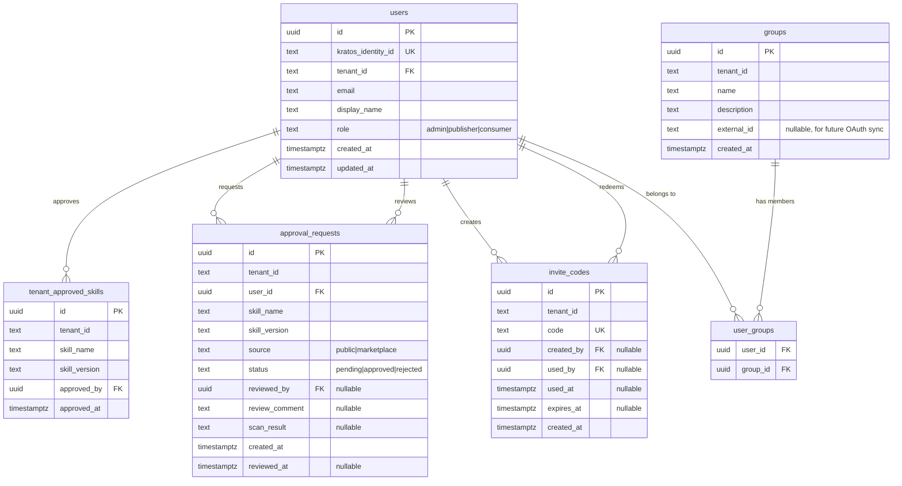

# Enterprise Skill Registry

## Overview

Build an enterprise-grade skill registry that enables developers to discover, request, and install AI coding skills through a governed workflow. The system introduces user identity via Ory Kratos + Hydra, a Marketplace UI built with Next.js + shadcn/ui, CLI commands for authentication and skill installation, and an admin approval workflow for public marketplace skills.

This is the foundational enterprise feature for Skillbox, enabling SSO-ready authentication, role-based governance, and self-service skill distribution — all locally testable via Docker Compose.

## Problem Statement

(see origin: `docs/brainstorms/2026-03-19-enterprise-skill-registry-requirements.md`)

Enterprise teams cannot adopt Skillbox because:
- No user identity or SSO — only API key auth exists (`internal/api/middleware/auth.go:29-81`)
- No governance — any API key holder can push/execute skills without review
- No self-service installation — developers must manually manage skill files
- No marketplace — no way to discover available skills

## Proposed Solution

A four-layer implementation delivered in five phases:

1. **Identity Layer** — Ory Kratos (users) + Hydra (OAuth2/OIDC) with dual-mode auth middleware
2. **Data Layer** — Users, groups, and approval_requests tables with tenant-scoped RBAC
3. **Marketplace UI** — Separate Next.js app for browse, login, and admin dashboard
4. **CLI Layer** — `skillbox login`, `add`, `list`, `remove`, `logout` commands

## Technical Approach

### Architecture

```
┌─────────────────────────────────────────────────────────┐
│                    Developer Machine                     │
│                                                         │
│  skillbox login ──► Ory Hydra (Device Auth Grant)       │
│  skillbox add   ──► Skillbox API ──► approval check     │
│                     │                                   │
│  ~/.config/skillbox/credentials.json (tokens)           │
│  ~/.config/skillbox/skill-lock.json  (installed skills) │
│  .claude/skills/<name>/SKILL.md      (installed skill)  │
└─────────────────────────────────────────────────────────┘
         │                    │
         ▼                    ▼
┌─────────────┐    ┌──────────────────┐
│  Ory Hydra  │◄──►│  Ory Kratos      │
│  (OAuth2)   │    │  (Identity)      │
│  :4444/:4445│    │  :4433/:4434     │
└─────────────┘    └──────────────────┘
         │                    │
         ▼                    ▼
┌──────────────────────────────────────┐
│         Marketplace UI (Next.js)     │
│         :3000                        │
│  ┌─────────┐ ┌──────────┐ ┌───────┐ │
│  │ Login   │ │Marketplace│ │ Admin │ │
│  │ Pages   │ │ Browse    │ │ Dash  │ │
│  └─────────┘ └──────────┘ └───────┘ │
└──────────────────────────────────────┘
                    │
                    ▼
┌──────────────────────────────────────┐
│     Skillbox API (Go + Gin)          │
│     :8080                            │
│  ┌──────────┐  ┌───────────────────┐ │
│  │Dual Auth │  │ New Endpoints     │ │
│  │Middleware │  │ /v1/marketplace/* │ │
│  │JWT+APIKey│  │ /v1/approvals/*   │ │
│  └──────────┘  │ /v1/users/*       │ │
│                │ /v1/groups/*      │ │
│                └───────────────────┘ │
└──────────────────────────────────────┘
                    │
         ┌──────────┴──────────┐
         ▼                     ▼
┌─────────────┐    ┌───────────────┐
│ PostgreSQL  │    │ MinIO (S3)    │
│ :5432       │    │ :9000         │
│ skillbox db │    │ skill archives│
│ kratos  db  │    └───────────────┘
│ hydra   db  │
└─────────────┘
```

### Data Model (ERD)



### Deferred Questions Resolved

| Question | Resolution | Rationale |
|----------|-----------|-----------|
| Ory version pinning (R1) | Kratos v1.3.0, Hydra v2.3.0 | Stable releases with Device Auth Grant support (Ory OSS v25.4.0+) |
| JWT vs API-key detection (R4) | Check for `eyJ` prefix or 2+ dot separators | JWTs always start with base64 `{"` header; API keys are opaque |
| User-to-tenant mapping (R5) | Skillbox `users` table with `tenant_id` column | Simpler than Kratos metadata; full control; single-tenant per user in V1 |
| Tenant assignment on first login (R5) | Invite code system — admin creates codes, user provides at `skillbox login --invite <code>` or UI registration | First user becomes admin; no self-service tenant creation in V1 |
| Marketplace app location (R9) | `marketplace/` at project root | Consistent with `landing-page/` and `docs-site/` patterns |
| Kratos UI rendering (R10) | Render flow nodes manually with shadcn components | Full design control; consistent with existing shadcn usage; no `@ory/elements` dependency |
| Skill resolution (R15) | CLI calls Skillbox API which checks approval | Server-side logic; tenant context needed for approval check |
| Claude Code skill path (R19) | `.claude/skills/<name>/SKILL.md` | Confirmed by vercel-labs/skills agent detection (`agents.ts`) |
| Ory database setup (R24) | Same Postgres container, separate databases (`skillbox_kratos`, `skillbox_hydra`) | Kratos/Hydra run own migrations; must not conflict with `sandbox` schema |

### SpecFlow Gaps Addressed

| Gap | Resolution |
|-----|-----------|
| Dual auth coexistence | Phase 1: `AuthMiddleware` detects token format, routes to JWT or API-key path. Both set same context keys. |
| User-to-tenant mapping | `users.tenant_id` column. V1: one tenant per user. Multi-tenant deferred. |
| Tenant assignment on first login | Invite code system. Admin creates invite codes per tenant. User provides code at registration or `skillbox login --invite <code>`. First user with a code becomes admin. |
| Admin role enforcement | `users.role` field + `RequireRole("admin")` middleware for admin endpoints. |
| `add` vs `push` relationship | `push` = upload to private tenant registry. `add` = install from marketplace. Orthogonal commands. |
| Approval deduplication | UNIQUE constraint on `(tenant_id, skill_name, skill_version)` in `approval_requests`. `also_requested_by` JSONB column tracks additional users who requested the same skill. |
| `skillbox logout` | Added as V1 command — clears `~/.config/skillbox/credentials.json`. |
| Scanner failure on approval | Approval blocked. `scan_result` column stores output. Admin can re-trigger or reject. |
| Marketplace data source | Existing Git→DB sync populates marketplace. Skills with no `tenant_id` (or a `public` pseudo-tenant) are marketplace skills. |
| Credential security | `0600` file permissions. OS keychain deferred to V2. |
| Browsing without auth | Public marketplace browsable without login. Auth required for `skillbox add` command and approval actions. |
| Skill already exists on add | CLI prompts "Skill already installed. Overwrite? [y/N]". `--force` flag skips prompt. |

### Implementation Phases

#### Phase 1: Infrastructure & Auth Foundation

**Goal:** Ory Kratos + Hydra running locally, dual-mode auth middleware, database migrations.

**Tasks:**

- [x] Create Ory config files
  - `config/ory/kratos.yml` — identity schema, self-service flow URLs, Hydra integration (`oauth2_provider.url`)
  - `config/ory/identity.schema.json` — email (identifier), name.first, name.last
  - Hydra configured via Docker Compose env vars (no separate hydra.yml needed)
- [x] Create database initialization script
  - `scripts/init-ory-databases.sh` — creates `skillbox_kratos` and `skillbox_hydra` databases in same Postgres
- [x] Update Docker Compose (`deploy/docker/docker-compose.yml`)
  - Add `kratos-migrate`, `kratos`, `hydra-migrate`, `hydra`, `mailslurper` services
  - Add `hydra-init` sidecar to register CLI OAuth2 client (device auth grant)
  - Update `postgres` service with init script for multiple databases
  - Add port mapping: Kratos 4433/4434, Hydra 4444/4445, MailSlurper 4436, Marketplace 3000
- [x] Create database migration `internal/store/migrations/008_users_groups_approvals.sql`

  ```sql
  -- +goose Up
  CREATE TABLE sandbox.users (
      id UUID PRIMARY KEY DEFAULT gen_random_uuid(),
      kratos_identity_id TEXT NOT NULL UNIQUE,
      tenant_id TEXT NOT NULL,
      email TEXT NOT NULL,
      display_name TEXT NOT NULL DEFAULT '',
      role TEXT NOT NULL DEFAULT 'consumer' CHECK (role IN ('admin', 'publisher', 'consumer')),
      created_at TIMESTAMPTZ NOT NULL DEFAULT NOW(),
      updated_at TIMESTAMPTZ NOT NULL DEFAULT NOW()
  );
  CREATE INDEX idx_users_tenant_id ON sandbox.users(tenant_id);
  CREATE INDEX idx_users_email ON sandbox.users(email);

  CREATE TABLE sandbox.groups (
      id UUID PRIMARY KEY DEFAULT gen_random_uuid(),
      tenant_id TEXT NOT NULL,
      name TEXT NOT NULL,
      description TEXT NOT NULL DEFAULT '',
      external_id TEXT,
      created_at TIMESTAMPTZ NOT NULL DEFAULT NOW(),
      UNIQUE(tenant_id, name)
  );
  CREATE INDEX idx_groups_tenant_id ON sandbox.groups(tenant_id);

  CREATE TABLE sandbox.user_groups (
      user_id UUID NOT NULL REFERENCES sandbox.users(id) ON DELETE CASCADE,
      group_id UUID NOT NULL REFERENCES sandbox.groups(id) ON DELETE CASCADE,
      PRIMARY KEY (user_id, group_id)
  );

  CREATE TABLE sandbox.invite_codes (
      id UUID PRIMARY KEY DEFAULT gen_random_uuid(),
      tenant_id TEXT NOT NULL,
      code TEXT NOT NULL UNIQUE,
      created_by UUID REFERENCES sandbox.users(id),
      used_by UUID REFERENCES sandbox.users(id),
      used_at TIMESTAMPTZ,
      expires_at TIMESTAMPTZ,
      created_at TIMESTAMPTZ NOT NULL DEFAULT NOW()
  );
  CREATE INDEX idx_invite_codes_code ON sandbox.invite_codes(code);

  CREATE TABLE sandbox.approval_requests (
      id UUID PRIMARY KEY DEFAULT gen_random_uuid(),
      tenant_id TEXT NOT NULL,
      user_id UUID NOT NULL REFERENCES sandbox.users(id),
      skill_name TEXT NOT NULL,
      skill_version TEXT NOT NULL DEFAULT 'latest',
      status TEXT NOT NULL DEFAULT 'pending' CHECK (status IN ('pending', 'approved', 'rejected')),
      also_requested_by JSONB NOT NULL DEFAULT '[]',
      reviewed_by UUID REFERENCES sandbox.users(id),
      review_comment TEXT,
      scan_result TEXT,
      created_at TIMESTAMPTZ NOT NULL DEFAULT NOW(),
      reviewed_at TIMESTAMPTZ,
      UNIQUE(tenant_id, skill_name, skill_version)
  );
  CREATE INDEX idx_approval_requests_tenant_status ON sandbox.approval_requests(tenant_id, status);

  CREATE TABLE sandbox.tenant_approved_skills (
      id UUID PRIMARY KEY DEFAULT gen_random_uuid(),
      tenant_id TEXT NOT NULL,
      skill_name TEXT NOT NULL,
      skill_version TEXT NOT NULL,
      approved_by UUID NOT NULL REFERENCES sandbox.users(id),
      approved_at TIMESTAMPTZ NOT NULL DEFAULT NOW(),
      UNIQUE(tenant_id, skill_name, skill_version)
  );
  CREATE INDEX idx_tenant_approved_skills_tenant ON sandbox.tenant_approved_skills(tenant_id);

  -- +goose Down
  DROP TABLE IF EXISTS sandbox.tenant_approved_skills;
  DROP TABLE IF EXISTS sandbox.approval_requests;
  DROP TABLE IF EXISTS sandbox.invite_codes;
  DROP TABLE IF EXISTS sandbox.user_groups;
  DROP TABLE IF EXISTS sandbox.groups;
  DROP TABLE IF EXISTS sandbox.users;
  ```

- [x] Extend `internal/config/config.go` — add Ory config fields (KratosPublicURL, KratosAdminURL, HydraPublicURL, HydraAdminURL)
- [x] Extend auth middleware (`internal/api/middleware/auth.go`)
  - Added `ContextKeyUserID = "user_id"` and `ContextKeyAuthType` constants
  - JWT detection via `isJWT()` — checks `eyJ` prefix + 2 dots
  - JWT path: validates via Hydra token introspection, resolves user from `sandbox.users`, sets context keys
  - API-key path: existing logic unchanged
  - Both paths set `ContextKeyTenantID` — `GetTenantID(c)` works for both
- [x] Add `OptionalAuthMiddleware` — passes through on missing/invalid tokens, sets context keys only when valid
- [x] Add `RequireRole` middleware (`internal/api/middleware/role.go`)
  - API-key auth bypasses role checks (backwards compat)
- [x] Add store layer for users, groups, approvals, and invite codes
  - `internal/store/users.go` — CreateUser, GetUserByKratosID, GetUserByID, GetOrCreateUser, ListUsers, UpdateUserRole
  - `internal/store/groups.go` — CRUD + membership management (AddUserToGroup, RemoveUserFromGroup, ListGroupMembers)
  - `internal/store/approvals.go` — CreateApprovalRequest (with UNIQUE dedup), ListApprovalRequests, UpdateApprovalStatus, IsSkillApprovedForTenant, ApproveSkillForTenant
  - `internal/store/invites.go` — GenerateInviteCode, CreateInviteCode, RedeemInviteCode, ListInviteCodes, CountUsersInTenant

**Success criteria:** `docker-compose up` starts all services. Kratos login flow works in browser. Hydra issues tokens. Migration creates all tables.

**Estimated effort:** Large

---

#### Phase 2: Store Layer & API Endpoints

**Goal:** CRUD operations for users, groups, approvals. New API endpoints wired into router.

**Tasks:**

- [ ] Create `internal/store/users.go`
  - `CreateUser(ctx, *User) error`
  - `GetUserByKratosID(ctx, kratosID string) (*User, error)`
  - `GetUser(ctx, id uuid.UUID) (*User, error)`
  - `ListUsers(ctx, tenantID string) ([]*User, error)`
  - `UpdateUserRole(ctx, id uuid.UUID, role string) error`
  - `GetOrCreateUser(ctx, kratosID, tenantID, email, displayName string) (*User, error)` — upsert on first login
  - Return `store.ErrNotFound` for missing records (not nil, nil — see learnings)

- [ ] Create `internal/store/groups.go`
  - `CreateGroup(ctx, *Group) error`
  - `ListGroups(ctx, tenantID string) ([]*Group, error)`
  - `UpdateGroup(ctx, *Group) error`
  - `DeleteGroup(ctx, id uuid.UUID) error`
  - `AddUserToGroup(ctx, userID, groupID uuid.UUID) error`
  - `RemoveUserFromGroup(ctx, userID, groupID uuid.UUID) error`
  - `ListGroupMembers(ctx, groupID uuid.UUID) ([]*User, error)`

- [ ] Create `internal/store/approvals.go`
  - `CreateApprovalRequest(ctx, *ApprovalRequest) error` — with UNIQUE conflict handling (return existing if duplicate)
  - `ListApprovalRequests(ctx, tenantID string, status string) ([]*ApprovalRequest, error)`
  - `GetApprovalRequest(ctx, id uuid.UUID) (*ApprovalRequest, error)`
  - `UpdateApprovalStatus(ctx, id uuid.UUID, status string, reviewerID uuid.UUID, comment string) error`
  - `IsSkillApprovedForTenant(ctx, tenantID, skillName string) (bool, error)` — checks `tenant_approved_skills`
  - `ApproveSkillForTenant(ctx, tenantID, skillName, version string, approvedBy uuid.UUID) error` — inserts into `tenant_approved_skills`
  - Use `s.conn()` consistently (see learnings: store pattern)
  - Use `RunInTx` for approve flow (update approval_requests + insert tenant_approved_skills)

- [ ] Create API handlers
  - `internal/api/handlers/users.go` — `GET /v1/users` (admin only), `GET /v1/users/me`, `PUT /v1/users/:id/role` (admin only)
  - `internal/api/handlers/groups.go` — CRUD + member management (admin only)
  - `internal/api/handlers/approvals.go` — `POST /v1/approvals` (create request), `GET /v1/approvals` (list, filtered by status), `PUT /v1/approvals/:id` (approve/reject, admin only)
  - `internal/api/handlers/marketplace.go` — `GET /v1/marketplace/skills` (public, paginated, search via `?q=`), `GET /v1/marketplace/skills/:name` (detail with approval status for authenticated user)

- [ ] Wire routes in `internal/api/router.go`

  ```go
  // After existing v1 routes (line 37):

  // Marketplace (public — auth optional, enriches response with tenant approval status)
  marketplace := r.Group("/v1/marketplace")
  marketplace.Use(middleware.OptionalAuthMiddleware(s)) // sets context keys if token present, no 401 if absent
  {
      marketplace.GET("/skills", handlers.ListMarketplaceSkills(s))
      marketplace.GET("/skills/:name", handlers.GetMarketplaceSkill(s))
  }

  // User endpoints (authenticated)
  users := v1.Group("/users")
  {
      users.GET("/me", handlers.GetCurrentUser(s))
      users.GET("", middleware.RequireRole("admin"), handlers.ListUsers(s))
      users.PUT("/:id/role", middleware.RequireRole("admin"), handlers.UpdateUserRole(s))
  }

  // Group endpoints (admin only)
  groups := v1.Group("/groups")
  groups.Use(middleware.RequireRole("admin"))
  {
      groups.POST("", handlers.CreateGroup(s))
      groups.GET("", handlers.ListGroups(s))
      groups.PUT("/:id", handlers.UpdateGroup(s))
      groups.DELETE("/:id", handlers.DeleteGroup(s))
      groups.POST("/:id/members", handlers.AddGroupMember(s))
      groups.DELETE("/:id/members/:userId", handlers.RemoveGroupMember(s))
  }

  // Approval endpoints
  approvals := v1.Group("/approvals")
  {
      approvals.POST("", handlers.CreateApprovalRequest(s))
      approvals.GET("", handlers.ListApprovalRequests(s))
      approvals.PUT("/:id", middleware.RequireRole("admin"), handlers.UpdateApprovalRequest(s))
  }
  ```

- [ ] Add marketplace skill resolution
  - Marketplace skills = skills in `sandbox.skills` where `tenant_id = 'public'` (pseudo-tenant)
  - `ListMarketplaceSkills` queries with `tenant_id = 'public'` + optional ILIKE search on name/description
  - `GetMarketplaceSkill` includes `is_approved` field based on authenticated user's tenant

**Success criteria:** All CRUD endpoints return correct data. Approval flow works end-to-end via API. Marketplace search returns results.

**Estimated effort:** Large

---

#### Phase 3: CLI Commands

**Goal:** `skillbox login`, `add`, `list`, `remove`, `logout` commands working end-to-end.

**Tasks:**

- [ ] Create `internal/cli/auth.go` — credential management
  - `CredentialStore` struct managing `~/.config/skillbox/credentials.json`
  - `Load() (*Credentials, error)` — read + validate token expiry
  - `Save(accessToken, refreshToken, email string, expiresAt time.Time) error` — write with `0600` permissions
  - `Clear() error` — delete credentials file
  - `IsLoggedIn() bool`
  - `RefreshIfNeeded(hydraURL string) error` — silent token refresh using refresh_token grant
  - Credentials JSON format:
    ```json
    {
      "access_token": "...",
      "refresh_token": "...",
      "expires_at": "2026-03-19T15:00:00Z",
      "email": "dev@example.com",
      "tenant_id": "..."
    }
    ```

- [ ] Create `internal/cli/device_auth.go` — Device Authorization Grant flow
  - `StartDeviceAuth(hydraURL, clientID string) (*DeviceAuthResponse, error)` — POST to `/oauth2/device/auth`
  - `PollForToken(hydraURL, clientID, deviceCode string, interval int) (*TokenResponse, error)` — poll `/oauth2/token` with backoff
  - Display: "Open {verification_uri} in your browser and enter code: {user_code}"
  - Handle: `authorization_pending`, `slow_down`, `expired_token`, `access_denied` responses
  - Auto-open browser via `open` (macOS) / `xdg-open` (Linux)

- [ ] Create `internal/cli/installer.go` — skill installation logic
  - `ResolveSkill(apiClient, skillName string) (*SkillInfo, error)` — call marketplace API
  - `CheckApproval(apiClient, skillName string) (ApprovalStatus, error)` — check if approved for tenant
  - `RequestApproval(apiClient, skillName string) error` — create approval request
  - `DownloadSkill(apiClient, skillName, version string) ([]byte, error)` — download skill archive
  - `InstallSkill(skillName string, data []byte, global bool) (string, error)` — extract and copy to provider path
  - Provider path resolution (V1: Claude Code only):
    - Project: `.claude/skills/<skill_name>/SKILL.md`
    - Global: `~/.claude/skills/<skill_name>/SKILL.md`
  - Lock file management at `~/.config/skillbox/skill-lock.json`

- [ ] Add CLI commands to `cmd/skillbox/main.go`

  - `skillbox login` (`newLoginCmd()`)
    - Accepts optional `--invite <code>` flag for first-time tenant assignment
    - Runs Device Auth Grant flow
    - After token received: call `GET /v1/users/me` to resolve user info
    - If user has no tenant (first login): require `--invite` code, call `POST /v1/invites/redeem`, assign user to tenant
    - If user already has a tenant: ignore `--invite` flag, proceed
    - Stores credentials (including `tenant_id`)
    - Prints "Logged in as {email} (tenant: {tenant_id})"

  - `skillbox logout` (`newLogoutCmd()`)
    - Clears credentials file
    - Prints "Logged out successfully"

  - `skillbox add <skill_name>` (`newAddCmd()`)
    - Check credentials → prompt `skillbox login` if not logged in
    - Resolve skill from marketplace API
    - If skill not found → error "Skill not found in marketplace"
    - Check approval status for tenant
    - If not approved → create request, print "Approval requested. Run `skillbox add {name}` again after admin approves.", exit
    - If approved → download, ask provider (V1: auto-detect Claude Code), ask scope (project/global), install
    - If already installed → prompt overwrite (or `--force`)
    - Update lock file
    - Print "Installed {name} to {path}. Use it in Claude Code!"

  - `skillbox list` (`newListCmd()`)
    - Read lock file
    - Print table: name, version, provider, scope, installed-at

  - `skillbox remove <skill_name>` (`newRemoveCmd()`)
    - Check lock file for installed skill
    - Delete skill directory
    - Update lock file
    - Print "Removed {name}"

- [ ] Add `--global` flag to `add` command (default: project scope)
- [ ] Add `--force` flag to `add` command (skip overwrite prompt)

**Success criteria:** Full CLI flow works: login → add (pending) → admin approves → add (installs) → list → remove. Token refresh works silently.

**Estimated effort:** Large

---

#### Phase 4: Marketplace UI

**Goal:** Separate Next.js app with login, marketplace browse, and admin dashboard.

**Tasks:**

- [ ] Scaffold Next.js app at `marketplace/`
  - `npx create-next-app@latest marketplace --typescript --tailwind --app --src-dir`
  - Copy shadcn/ui config from `landing-page/components.json`
  - Install dependencies: `@ory/client`, `lucide-react`, `next-themes`
  - Initialize shadcn: `npx shadcn@latest init`
  - Copy needed UI components from `landing-page/components/ui/`

- [ ] Ory integration layer (`marketplace/src/lib/ory.ts`)
  - `FrontendApi` client configured with Kratos public URL
  - `createBrowserLoginFlow()`, `createBrowserRegistrationFlow()` helpers
  - Session check middleware for protected pages
  - Consent handler for Hydra OAuth2 flows

- [ ] Auth pages
  - `marketplace/src/app/auth/login/page.tsx` — fetch Kratos login flow, render form fields with shadcn Input/Button
  - `marketplace/src/app/auth/register/page.tsx` — Kratos registration flow
  - `marketplace/src/app/auth/recovery/page.tsx` — password recovery
  - `marketplace/src/app/auth/verification/page.tsx` — email verification
  - `marketplace/src/app/auth/consent/page.tsx` — Hydra OAuth2 consent screen
  - `marketplace/src/app/auth/device/page.tsx` — device code verification (user enters code here)
  - `marketplace/src/app/auth/device/success/page.tsx` — "You can close this tab" success page

- [ ] Marketplace pages
  - `marketplace/src/app/page.tsx` — public landing with search bar, skill grid
  - `marketplace/src/app/skills/page.tsx` — full skill listing with search, pagination
  - `marketplace/src/app/skills/[name]/page.tsx` — skill detail with `skillbox add` copy button, approval status badge

- [ ] Admin pages (protected by role check)
  - `marketplace/src/app/admin/page.tsx` — dashboard overview: pending count, recent approvals
  - `marketplace/src/app/admin/approvals/page.tsx` — list pending/approved/rejected requests with filters
  - `marketplace/src/app/admin/approvals/[id]/page.tsx` — approval detail: skill info, requester, approve/reject with comment
  - `marketplace/src/app/admin/users/page.tsx` — user list with role management
  - `marketplace/src/app/admin/groups/page.tsx` — group CRUD, member management

- [ ] Shared components
  - `SkillCard` — name, description, provider badges, copy command button
  - `ApprovalBadge` — pending (yellow), approved (green), rejected (red)
  - `CopyCommand` — click-to-copy `skillbox add <name>` with toast feedback
  - `AdminNav` — sidebar navigation for admin section
  - `SearchBar` — debounced search input calling marketplace API

- [ ] Add marketplace service to Docker Compose
  ```yaml
  marketplace:
    build: ../../marketplace
    ports:
      - "3000:3000"
    environment:
      NEXT_PUBLIC_KRATOS_URL: http://localhost:4433
      NEXT_PUBLIC_HYDRA_URL: http://localhost:4444
      NEXT_PUBLIC_API_URL: http://localhost:8080
    depends_on:
      kratos:
        condition: service_healthy
  ```

**Success criteria:** Developer can register, login, browse marketplace, copy install command. Admin can view and manage approval requests. Device verification page works for CLI login flow.

**Estimated effort:** Large

---

#### Phase 5: Integration Testing & Polish

**Goal:** End-to-end flow validation, error handling, documentation.

**Tasks:**

- [ ] Integration test: full developer flow
  - Register in UI → Login → Browse → `skillbox add` → Login via CLI → Approval request created → Admin approves → `skillbox add` succeeds → Skill files in `.claude/skills/`
- [ ] Integration test: API key backwards compatibility
  - Existing `skillbox run` and `skillbox skill push` with API keys still work unchanged
- [ ] Integration test: dual auth middleware
  - JWT token → correct tenant + user resolution
  - API key → existing behavior
  - Invalid/expired tokens → 401
  - Admin role enforcement → 403 for non-admins
- [ ] Error handling polish
  - CLI: network errors, timeout, invalid credentials, skill not found
  - API: proper error codes and messages for all new endpoints
  - UI: loading states, error boundaries, empty states
- [ ] Add CORS configuration for marketplace origin on Kratos and API
- [ ] Update `docs/API.md` with new endpoints
- [ ] Add `docs/ENTERPRISE.md` setup guide — how to configure Ory, run locally, add first admin user
- [ ] Seed script: `scripts/seed-admin.sh` — creates first admin user for a tenant via Kratos Admin API

**Success criteria:** All success criteria from origin document met. Existing API key auth unbroken. Clean error messages for all failure paths.

**Estimated effort:** Medium

## System-Wide Impact

### Interaction Graph

- `skillbox login` → Hydra `/oauth2/device/auth` → Kratos login flow → Hydra token issuance → CLI stores token
- `skillbox add` → Skillbox API (JWT auth) → `AuthMiddleware` (JWT path) → user resolution → approval check → download → local file copy
- Admin approve → `PUT /v1/approvals/:id` → `RequireRole("admin")` → `RunInTx` (update approval + insert tenant_approved_skills) → security scanner → response
- Marketplace browse → `GET /v1/marketplace/skills` (no auth) → `sandbox.skills WHERE tenant_id = 'public'` → paginated response

### Error Propagation

- Hydra token validation errors → 401 from auth middleware → CLI shows "Session expired. Run `skillbox login`"
- Store `ErrNotFound` → handler translates to 404 (follow sentinel error boundary pattern from learnings)
- Approval request duplicate → UNIQUE constraint → store returns existing request (not error)
- Security scanner failure → `scan_result` column updated → approval stays pending → admin sees result

### State Lifecycle Risks

- **Partial approval failure:** `RunInTx` wraps approval status update + tenant_approved_skills insert. If either fails, both roll back.
- **Orphaned approval requests:** If a skill is removed from marketplace after request → admin can still approve/reject, but install will fail. Acceptable in V1.
- **Stale lock file:** If user deletes skill files manually, lock file is stale. `skillbox list` should check file existence.

### API Surface Parity

- Go SDK: add `Login()`, `ListMarketplaceSkills()`, `CreateApprovalRequest()`, `ListApprovalRequests()`, `ApproveRequest()` methods
- Python SDK: add equivalent methods (deferred — Python SDK already 60% behind)
- CLI: new commands `login`, `logout`, `add`, `list`, `remove`

## Acceptance Criteria

### Functional Requirements

- [ ] Developer can register and login via Marketplace UI with email + password
- [ ] Marketplace browse page shows public skills with search
- [ ] `skillbox login` authenticates via Device Authorization Grant
- [ ] `skillbox add <name>` creates approval request for unapproved public skills
- [ ] `skillbox add <name>` downloads and installs approved skills to `.claude/skills/`
- [ ] Admin dashboard shows pending approval requests with approve/reject
- [ ] Security scanner runs on approval (or is invoked as a step)
- [ ] API key auth continues to work unchanged for all existing endpoints
- [ ] `docker-compose up` starts all services with zero manual setup
- [ ] Groups table exists and is manageable via admin UI

### Non-Functional Requirements

- [ ] Credentials file has 0600 permissions
- [ ] JWT validation adds <50ms latency (cached JWKS)
- [ ] Marketplace search responds in <500ms
- [ ] CLI login flow completes in <30 seconds
- [ ] All new store methods use `s.conn()` (not `s.db` directly)
- [ ] All error boundaries translate sentinel errors properly

### Quality Gates

- [ ] Unit tests for all new store methods
- [ ] Unit tests for auth middleware (JWT path + API-key path)
- [ ] Unit tests for CLI credential management
- [ ] Integration tests for approval workflow
- [ ] All existing tests pass unchanged

## Dependencies & Prerequisites

- Ory Kratos v1.3.0 Docker image (`oryd/kratos:v1.3.0`)
- Ory Hydra v2.3.0 Docker image (`oryd/hydra:v2.3.0`)
- MailSlurper Docker image (`oryd/mailslurper:latest-smtps`)
- `@ory/client` npm package for Next.js
- Docker Compose v2 on developer machines
- Existing Git→DB skill sync provides marketplace data
- Existing security scanner pipeline (from `docs/plans/2026-03-04-feat-security-scan-uploaded-skills-plan.md`)

## Risk Analysis & Mitigation

| Risk | Likelihood | Impact | Mitigation |
|------|-----------|--------|------------|
| Ory Kratos/Hydra integration complexity | Medium | High | Research done; Docker Compose configs from Ory docs. Start with Phase 1 validation. |
| JWT + API-key dual auth breaks existing handlers | Low | High | Both paths set same context keys. Existing tests must pass unchanged. |
| Device Auth Grant UX confusion | Medium | Medium | Clear CLI messages. Auto-open browser. Timeout handling. |
| Docker Compose cold start is slow (6+ services) | Medium | Low | Parallel service startup. Health check dependencies only where needed. |
| Marketplace UI scope creep | Medium | Medium | Strict adherence to V1 scope. No Entra ID, no email notifications, no group ACL logic. |

## Alternative Approaches Considered

(see origin: `docs/brainstorms/2026-03-19-enterprise-skill-registry-requirements.md`, Key Decisions section)

- **Keycloak instead of Ory:** Heavier, Java-based, harder to run locally. Ory is Go-native, lighter, OSS.
- **Auth0/Supabase Auth:** Not self-hosted, not locally testable without internet.
- **Integrated into landing-page:** Would bloat an existing app. Separate app has clearer concerns.
- **Authorization Code + PKCE for CLI:** Requires localhost HTTP server. Device Auth Grant is simpler and works in SSH/headless.

## Sources & References

### Origin

- **Origin document:** [docs/brainstorms/2026-03-19-enterprise-skill-registry-requirements.md](docs/brainstorms/2026-03-19-enterprise-skill-registry-requirements.md) — Key decisions carried forward: Ory Kratos + Hydra for auth, separate Next.js marketplace app, Device Authorization Grant for CLI, Claude Code only in V1, groups schema from day one.

### Internal References

- Auth middleware: `internal/api/middleware/auth.go:29-81`
- Context key contract: `internal/api/middleware/auth.go:17-20`
- Tenant middleware: `internal/api/middleware/tenant.go:19-61`
- Router wiring: `internal/api/router.go:25-95`
- Migration pattern: `internal/store/postgres.go:24,64` (goose embed + auto-run)
- Store method pattern: `internal/store/skills.go:23-36` (UpsertSkill)
- CLI command pattern: `cmd/skillbox/main.go:243-257` (newSkillCmd)
- Config loader: `internal/config/config.go:81-229`
- Docker Compose: `deploy/docker/docker-compose.yml:1-122`
- Security scanner plan: `docs/plans/2026-03-04-feat-security-scan-uploaded-skills-plan.md`
- Sentinel error learnings: `docs/solutions/runtime-errors/minio-error-sentinels-not-propagated-registry-20260226.md`

### External References

- Ory Kratos docs: https://www.ory.sh/docs/kratos
- Ory Hydra docs: https://www.ory.sh/docs/hydra
- Ory Device Authorization Grant: https://www.ory.sh/docs/oauth2-oidc/device-authorization
- RFC 8628 (Device Authorization Grant): https://datatracker.ietf.org/doc/html/rfc8628
- vercel-labs/skills CLI: https://github.com/vercel-labs/skills
- shadcn/ui: https://ui.shadcn.com
