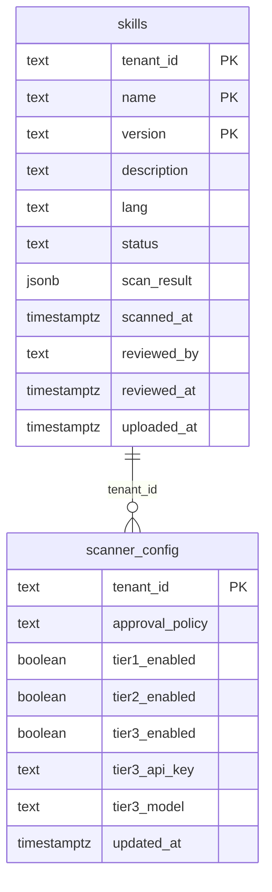

# feat: Registry-Level Scan Gate & Approval Workflow

## Overview

Replace the current inline-scan-on-upload approach with a registry-level scan gate that intercepts **all** skill ingestion paths. Skills land in `pending` status, get scanned asynchronously by a background worker, and are promoted to `available`, sent to `review`, or moved to `quarantine` based on scan results and admin-configured approval policy. The runner refuses to execute skills not in `available` status (fail-closed).

## Problem Statement

The security scanner currently only covers `POST /v1/skills` (zip upload). Two ingestion paths bypass it entirely:
- `POST /v1/skills/from-fields` — creates skills from structured JSON, no scan
- `POST /v1/github/install` — fetches skills from GitHub, no scan

Any future ingestion path (marketplace install, CLI import, etc.) must also remember to call the scanner. This is error-prone. The scanner must be impossible to bypass.

## Proposed Solution

Move the scan gate into the registry layer so `reg.Upload()` becomes `reg.Submit()`. All handlers converge on `Submit()`, which stores to a `pending/` prefix. A background goroutine picks up pending skills, scans them, and transitions their status. No handler can bypass the gate because direct upload to `available/` ceases to exist.

## Technical Approach

### Architecture

```
Handler (any)                  Registry                    Background Worker
     │                            │                              │
     ├─ normalize/validate ─────► │                              │
     │                            ├─ Submit()                    │
     │                            │   ├─ write .pending/ MinIO   │
     │                            │   ├─ upsert DB (pending)     │
     │                            │   └─ push to scanCh ────────►│
     │                            │                              ├─ update DB (scanning)
     │  ◄── 202 Accepted ────────┤                              ├─ run Pipeline.Scan()
     │                            │                              ├─ evaluate policy
     │                            │                              ├─ move object in MinIO
     │                            │                              └─ update DB (available/review/quarantined)
```

### Implementation Phases

#### Phase 1: Database Migration & Data Model
**Add status lifecycle to skills table and create scanner config table.**

- [ ] Create migration `internal/store/migrations/010_skill_status_and_scanner_config.sql`:
  ```sql
  -- Add status fields to skills table
  ALTER TABLE sandbox.skills
    ADD COLUMN status TEXT NOT NULL DEFAULT 'available',
    ADD COLUMN scan_result JSONB,
    ADD COLUMN scanned_at TIMESTAMPTZ,
    ADD COLUMN reviewed_by TEXT,
    ADD COLUMN reviewed_at TIMESTAMPTZ;

  -- Existing skills are already available (backward compat)
  -- New constraint for valid statuses
  ALTER TABLE sandbox.skills
    ADD CONSTRAINT skills_status_check
    CHECK (status IN ('pending', 'scanning', 'review', 'available', 'declined', 'quarantined'));

  -- Index for worker polling
  CREATE INDEX idx_skills_status ON sandbox.skills (status) WHERE status IN ('pending', 'scanning');

  -- Per-tenant scanner configuration
  CREATE TABLE sandbox.scanner_config (
    tenant_id        TEXT PRIMARY KEY REFERENCES sandbox.api_keys(tenant_id) ON DELETE CASCADE,
    approval_policy  TEXT NOT NULL DEFAULT 'auto'
      CHECK (approval_policy IN ('auto', 'always', 'none')),
    tier1_enabled    BOOLEAN NOT NULL DEFAULT true,
    tier2_enabled    BOOLEAN NOT NULL DEFAULT true,
    tier3_enabled    BOOLEAN NOT NULL DEFAULT false,
    tier3_api_key    TEXT,  -- encrypted at application layer
    tier3_model      TEXT NOT NULL DEFAULT 'claude-sonnet-4-5-20250514',
    updated_at       TIMESTAMPTZ NOT NULL DEFAULT now()
  );
  ```

- [ ] Add new fields to `SkillRecord` struct in `internal/store/skills.go`:
  ```go
  type SkillRecord struct {
      TenantID    string          `json:"tenant_id"`
      Name        string          `json:"name"`
      Version     string          `json:"version"`
      Description string          `json:"description"`
      Lang        string          `json:"lang"`
      Status      string          `json:"status"`
      ScanResult  json.RawMessage `json:"scan_result,omitempty"`
      ScannedAt   *time.Time      `json:"scanned_at,omitempty"`
      ReviewedBy  *string         `json:"reviewed_by,omitempty"`
      ReviewedAt  *time.Time      `json:"reviewed_at,omitempty"`
      UploadedAt  time.Time       `json:"uploaded_at"`
  }
  ```

- [ ] Add `ScannerConfig` struct and CRUD methods in `internal/store/scanner_config.go`
- [ ] Update `UpsertSkill()` to include status field (default `pending` for new inserts)
- [ ] Add `UpdateSkillStatus()` method for the worker to transition states
- [ ] Add `ListPendingSkills()` method for worker polling fallback
- [ ] Run tests: `go test ./internal/store/...`

#### Phase 2: Registry Submit & MinIO Bucket Layout
**Replace `reg.Upload()` with `reg.Submit()` that writes to pending prefix.**

- [ ] Add `Submit()` method to `internal/registry/registry.go`:
  ```go
  func (r *Registry) Submit(ctx context.Context, tenantID, skillName, version string, zipData io.Reader, size int64) error
  ```
  - Writes to `{tenantID}/.pending/{skillName}/{version}/skill.zip`
  - Same validation as current `Upload()` (zip header check)

- [ ] Add `Promote()` method:
  ```go
  func (r *Registry) Promote(ctx context.Context, tenantID, skillName, version string) error
  ```
  - Copies from `.pending/` to main path, deletes pending copy

- [ ] Add `Quarantine()` method:
  ```go
  func (r *Registry) Quarantine(ctx context.Context, tenantID, skillName, version string) error
  ```
  - Moves from `.pending/` to `.quarantine/` prefix

- [ ] Add `DownloadPending()` method (for scanner to read pending skills):
  ```go
  func (r *Registry) DownloadPending(ctx context.Context, tenantID, skillName, version string) (io.ReadCloser, error)
  ```

- [ ] Keep existing `Upload()` as internal/deprecated — only used by tests
- [ ] Update `Download()` to only return `available` skills (reads from main path only)
- [ ] Run tests: `go test ./internal/registry/...`

#### Phase 3: Background Scan Worker
**Implement the async goroutine that processes pending skills.**

- [ ] Create `internal/scanner/worker.go`:
  ```go
  type Worker struct {
      registry *registry.Registry
      store    *store.Store
      scanner  Scanner
      scanCh   chan ScanJob
      logger   *slog.Logger
  }

  type ScanJob struct {
      TenantID string
      Skill    string
      Version  string
  }

  func NewWorker(reg *registry.Registry, s *store.Store, sc Scanner, logger *slog.Logger) *Worker
  func (w *Worker) Start(ctx context.Context)  // launches goroutine
  func (w *Worker) Submit(job ScanJob)          // non-blocking send to channel
  ```

- [ ] Worker loop logic:
  1. Receive `ScanJob` from `scanCh`
  2. Update status to `scanning` in DB
  3. Download from `.pending/` via `reg.DownloadPending()`
  4. Build `*zip.Reader`, parse `*skill.Skill`
  5. Run `scanner.CheckZIPSafety()` + `scanner.Scan()`
  6. Evaluate result against tenant's `approval_policy`:
     - BLOCK → `reg.Quarantine()` + update DB to `quarantined`
     - FLAG + policy `auto` → update DB to `review`
     - FLAG + policy `always` → update DB to `review`
     - CLEAN + policy `auto`/`none` → `reg.Promote()` + update DB to `available`
     - CLEAN + policy `always` → update DB to `review`
  7. Store `ScanResult` JSON in DB

- [ ] Add startup recovery: on `Start()`, query DB for skills stuck in `pending`/`scanning` and re-queue them
- [ ] Run tests: `go test ./internal/scanner/...`

#### Phase 4: Scanner Stage Configuration
**Make scanner tiers toggleable per-tenant.**

- [ ] Modify `scanner.New()` to accept a `StageConfig`:
  ```go
  type StageConfig struct {
      Tier1Enabled bool
      Tier2Enabled bool
      Tier3Enabled bool
  }
  ```

- [ ] Modify `Pipeline.Scan()` to skip disabled tiers
- [ ] Add admin API endpoints in `internal/api/handlers/scanner_config.go`:
  - `GET /v1/admin/scanner/config` — get current tenant scanner config
  - `PUT /v1/admin/scanner/config` — update scanner config (approval policy, tier toggles)
- [ ] Wire endpoints in `internal/api/router.go` under the admin group
- [ ] Add env var fallbacks in `internal/config/config.go` for global defaults
- [ ] Run tests: `go test ./internal/scanner/... ./internal/api/...`

#### Phase 5: Update All Ingestion Handlers
**Switch handlers from `reg.Upload()` to `reg.Submit()` + `worker.Submit()`.**

- [ ] Update `UploadSkill` handler in `internal/api/handlers/skill.go`:
  - Remove inline scanner call (scanner moves to worker)
  - Keep `normalizeSkillZip()` and `validateSkillZip()` (fast, pre-storage validation)
  - Keep `CheckZIPSafety()` (fast, pre-storage)
  - Replace `reg.Upload()` with `reg.Submit()`
  - Call `worker.Submit(ScanJob{...})`
  - Change response from 201 to **202 Accepted** with `{status: "pending"}`
  - Return skill metadata including status

- [ ] Update `CreateFromFields` handler in `internal/api/handlers/skill_create.go`:
  - Replace `reg.Upload()` with `reg.Submit()`
  - Add `worker.Submit(ScanJob{...})`
  - Change response to 202 Accepted

- [ ] Update `MarketplaceService.Install()` in `internal/github/marketplace.go`:
  - Replace `m.reg.Upload()` with `m.reg.Submit()`
  - Return `ScanJob` info so handler can submit to worker
  - Or: pass worker into `MarketplaceService` and submit internally

- [ ] Update `InstallFromGitHub` handler to return 202 Accepted

- [ ] Run tests: `go test ./internal/api/... ./internal/github/...`

#### Phase 6: Runner Execution Gate (Fail-Closed)
**Runner refuses to execute skills not in `available` status.**

- [ ] Modify `Runner.Run()` in `internal/runner/runner.go`:
  - After resolving version (line ~101), before loading skill (line ~152):
  - Query `store.GetSkillStatus(tenantID, skill, version)` → if not `available`, return error
  - Error message: `"skill %s@%s is not available (status: %s)"`

- [ ] Add `GetSkillStatus()` method to store:
  ```go
  func (s *Store) GetSkillStatus(ctx context.Context, tenantID, name, version string) (string, error)
  ```

- [ ] Run tests: `go test ./internal/runner/...`

#### Phase 7: Admin Review Endpoints
**Add endpoints for admin to approve/decline skills in `review` status.**

- [ ] Create `internal/api/handlers/skill_review.go`:
  - `PUT /v1/admin/skills/:name/:version/review` — approve or decline
    - Body: `{"action": "approve"|"decline", "comment": "..."}`
    - On approve: `reg.Promote()` + update DB to `available`
    - On decline: update DB to `declined` (keep in pending MinIO or move to quarantine)
  - `GET /v1/admin/skills/review` — list skills in `review` status

- [ ] Wire endpoints in `internal/api/router.go` under admin group
- [ ] Run tests: `go test ./internal/api/...`

#### Phase 8: Skill Status in API Responses
**Update GET endpoints to include status and scan result visibility.**

- [ ] Update `GET /v1/skills` to include `status` field in response
- [ ] Update `GET /v1/skills/:name/:version` to include:
  - `status` for all users
  - `scan_result` (full findings) for admin only
  - `remediation` (hints only) for non-admin users
- [ ] Filter: by default, `ListSkills` returns only `available` skills
  - Add `?status=` query param for admin to filter by status
- [ ] Run tests: `go test ./internal/api/...`

#### Phase 9: Wire Everything in main.go
**Connect worker, scanner, and registry in the server startup.**

- [ ] Update `cmd/skillbox-server/main.go`:
  - Create `scanner.Worker` after creating `scanner.Pipeline`
  - Start worker goroutine with server context
  - Pass worker to router/handlers that need it
  - Graceful shutdown: cancel context, wait for worker to drain

- [ ] Update `NewRouter()` signature to accept `*scanner.Worker`
- [ ] Run full test suite: `go test ./...`
- [ ] Manual smoke test with docker-compose

## Acceptance Criteria

### Functional Requirements

- [ ] All three ingestion paths (upload, from-fields, github) route through `reg.Submit()` → async scan
- [ ] Scanner BLOCK → skill status `quarantined`, kept in `.quarantine/` bucket
- [ ] Scanner FLAG + policy `auto` → skill status `review`
- [ ] Scanner CLEAN + policy `auto`/`none` → skill status `available`
- [ ] Scanner any + policy `always` → skill status `review`
- [ ] Admin can approve/decline skills in `review` status
- [ ] Runner refuses to execute skills not in `available` status
- [ ] Admin can configure approval policy per tenant
- [ ] Admin can enable/disable scanner tiers independently
- [ ] Tier 3 (LLM) requires API key; disabled by default
- [ ] Existing skills remain `available` after migration (backward compat)

### Non-Functional Requirements

- [ ] Scan worker processes skills within 30s (Tier 1+2), 60s with Tier 3
- [ ] Worker recovers pending jobs on restart (startup recovery)
- [ ] No new infrastructure dependencies (goroutine + channel, not Redis)

### Quality Gates

- [ ] All existing tests pass after migration
- [ ] New tests for: worker state transitions, registry Submit/Promote/Quarantine, runner fail-closed gate, admin review endpoints
- [ ] `go vet ./...` clean

## Dependencies & Prerequisites

- Security scanner branch (`feat/security-scanner`) must be merged to main first
- Existing approval system tables (`008_users_groups_approvals.sql`) are in place

## Risk Analysis & Mitigation

| Risk | Impact | Mitigation |
|------|--------|------------|
| Worker crashes mid-scan | Skills stuck in `scanning` | Startup recovery re-queues stuck jobs |
| Scan takes too long | Channel backpressure | Bounded channel + timeout on scan context |
| Breaking change for API consumers | 201→202 response code | Document in changelog, SDK update |
| Migration on existing data | Existing skills must stay available | `DEFAULT 'available'` ensures backward compat |

## ERD: Skill Lifecycle



## References & Research

### Internal References
- Scanner pipeline: `internal/scanner/scanner.go` — Scanner interface, Pipeline struct
- Registry: `internal/registry/registry.go:75` — Upload(), Download(), Delete()
- Runner execution: `internal/runner/runner.go:152` — LoadSkill call (fail-closed gate point)
- UploadSkill handler: `internal/api/handlers/skill.go:35` — current inline scan
- CreateFromFields: `internal/api/handlers/skill_create.go:76` — bypasses scanner
- GitHub Install: `internal/github/marketplace.go:333` — bypasses scanner
- Existing approvals: `internal/store/approvals.go` — ApprovalRequest struct
- Next migration: `internal/store/migrations/010_*`

### External References
- Brainstorm: `docs/brainstorms/2026-03-25-scanner-pipeline-brainstorm.md`
- JFrog AI Skill Registry scanning model (two-phase: rapid + deep)
- Azure ACR quarantine model (auto-quarantine → scan → promote/reject)
